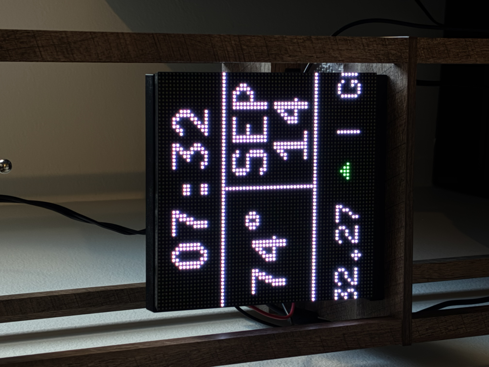
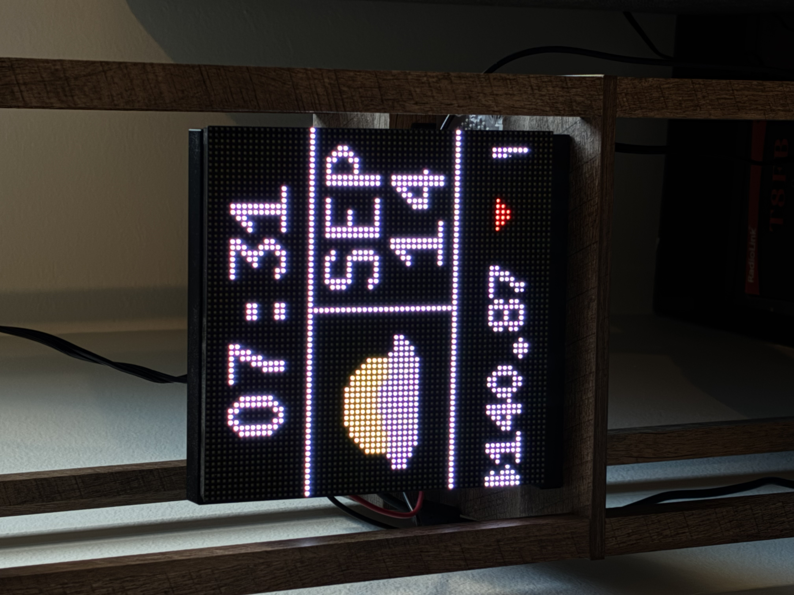
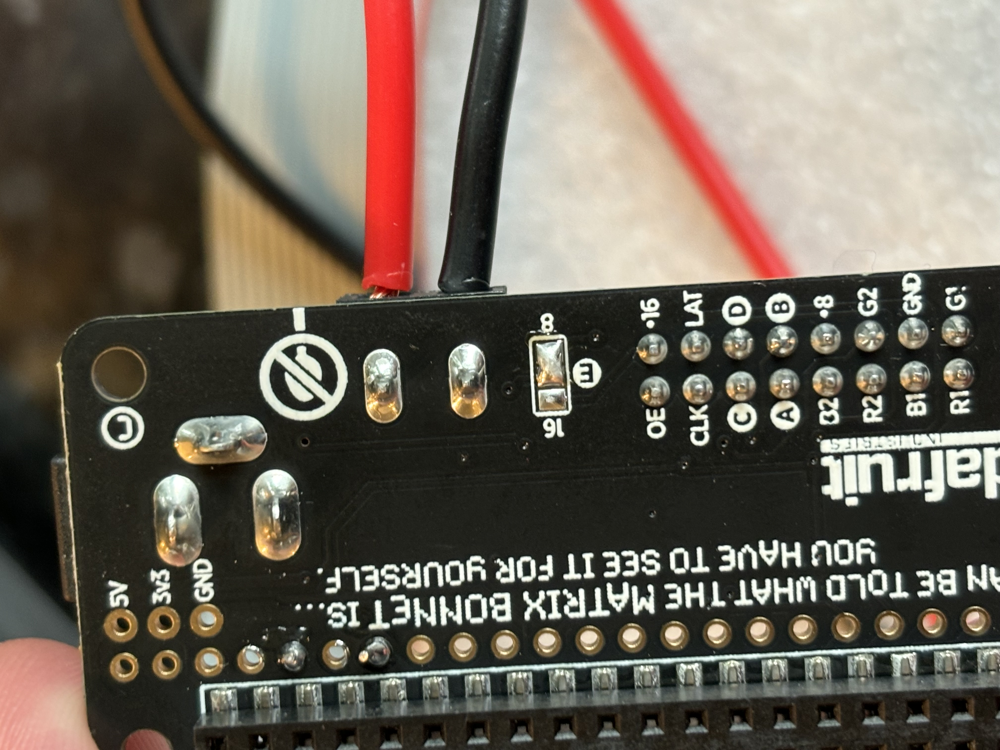
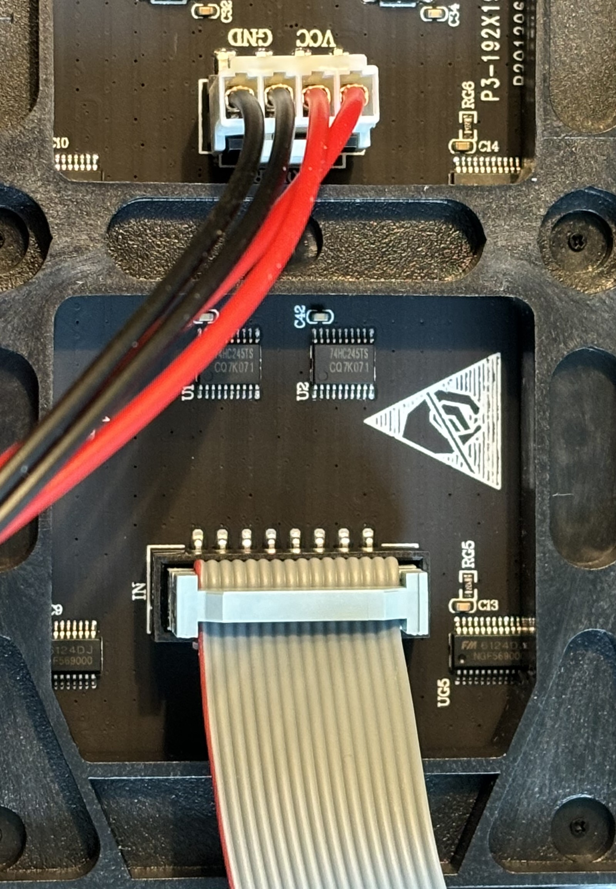
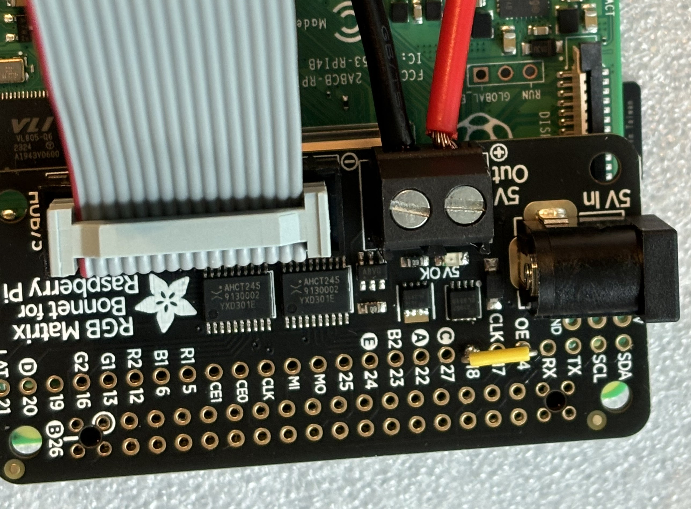
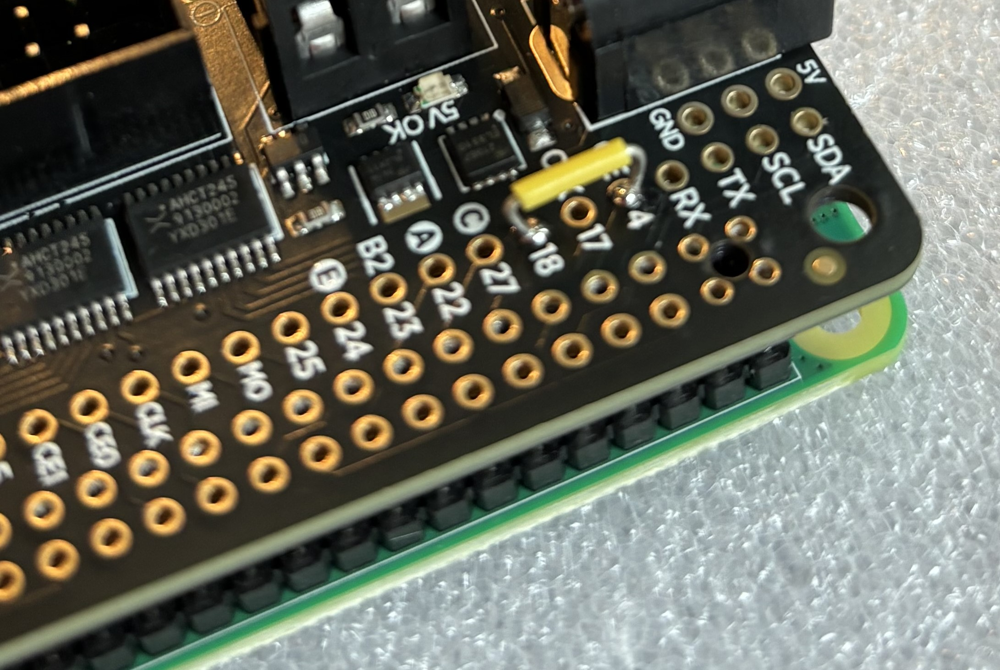

# LED Display

**Time, weather, and the market on a Raspberry Pi LED matrix.**

Turn a 64x64 RGB LED panel into an always-on information display. This Python project combines a clock, calendar, local weather, and a scrolling stock ticker, with a USB keypad for control and an installer that configures startup on boot.

<p align="center">
  
  
</p>

<p align="center"><em>The weather panel alternates between temperature and a conditions icon.</em></p>

[Features](#features) · [Parts](#parts) · [Hardware setup](#hardware-setup) · [Install software](#install-software) · [Controls](#controls-and-service-management) · [Configuration](#configuration) · [Troubleshooting](#troubleshooting)

## Features

- **Clock and calendar:** a 12-hour clock, month, and day using the Pi's local time.
- **Local weather:** temperature in Fahrenheit and icons for clear skies, clouds, rain, snow, and storms, with day and night variants where applicable.
- **Scrolling stock ticker:** near-live Yahoo Finance one-minute prices, with green, red, and yellow indicators for changes from the previous session's close.
- **Automatic startup:** a systemd service launches the display when the Pi boots.
- **Keypad controls:** restart the display or reboot the Pi from a connected keypad.

Weather refreshes every five minutes, and the temperature/icon view switches every 15 seconds. Stock requests are spaced two seconds apart, for a maximum of about 1,800 requests per hour. Yahoo data may be delayed and is subject to unofficial endpoint throttling; lower the request rate if temporary blocks occur.

## Parts

This guide covers **one 64x64 HUB75 panel, an Adafruit RGB Matrix Bonnet, and a Raspberry Pi 3 or 4**. The display layout is designed for 64x64 pixels; other sizes require configuration and layout changes.

| Part | Notes |
| --- | --- |
| [Adafruit 64x64 RGB LED matrix](https://www.adafruit.com/product/5362) | Include the HUB75 ribbon cable and panel power cable. |
| [Adafruit RGB Matrix Bonnet](https://www.adafruit.com/product/3211) | Connects the panel to the Pi's 40-pin GPIO header. |
| Raspberry Pi 3 or 4 | The installer reserves CPU core 3 for display use. Other Pi models may need adjustments. |
| Matrix power supply | Regulated 5 V. The original parts list specifies 4 A; size the supply for your panel and brightness. |
| Raspberry Pi power supply | Use a suitable supply connected to the Pi's power port. |
| microSD card | For Raspberry Pi OS and the project files. |
| USB numeric keypad or keyboard | Required by the default launcher, including at boot. |
| Soldering iron, solder, and jumper wire | For the bonnet's address connection and optional flicker reduction. |
| Computer and network connection | For imaging the card and connecting over SSH. A local monitor and keyboard also work. |

Internet access is needed for installation, weather, automatic location lookup, and stock updates. You will need an API key from **OpenWeather**; setup is covered below.

## Hardware setup

Disconnect power before soldering or changing connections. These steps follow [Adafruit's bonnet assembly guide](https://learn.adafruit.com/adafruit-rgb-matrix-bonnet-for-raspberry-pi/matrix-setup).

### 1. Configure the bonnet for a 64x64 panel

On the underside of the bonnet, bridge the center **E** pad to the **8** pad with solder. This is the connection for the linked Adafruit panel. For a different panel, check its datasheet: some use the **16** pad instead.

<details>
<summary>Photo: E-to-8 solder bridge</summary>

<p align="center">
  
</p>

</details>

### 2. Connect the panel and Pi

1. Seat the bonnet on the Pi's 40-pin GPIO header, with all pins aligned.
2. Connect the ribbon cable from the bonnet to the panel's **IN** connector.
3. Connect the panel power cable to the bonnet's screw terminal: **red to 5 V**, **black to GND**. If the cable end does not fit, prepare the wire ends for the terminal and secure them firmly.
4. Plug the USB keypad into the Pi.

<details>
<summary>Photos: panel cables and bonnet power terminal</summary>

<p align="center">
  
  
</p>

</details>

Power the panel through the bonnet's DC input and the Pi through its own power port. See [Adafruit's power guidance](https://learn.adafruit.com/adafruit-rgb-matrix-bonnet-for-raspberry-pi/pinouts) for supply requirements.

### 3. Optional: reduce flicker

Solder a jumper between the bonnet pads labeled **GPIO 4** and **GPIO 18**. These are GPIO numbers, not physical header pin numbers.

<details>
<summary>Photo: GPIO 4-to-18 jumper</summary>

<p align="center">
  
</p>

</details>

To use this modification, select **`adafruit-hat-pwm`** in the [display settings](#display-settings). The launcher currently defaults to `adafruit-hat`; installing the jumper does not change that setting automatically. See the matrix library's [hardware modification instructions](https://github.com/hzeller/rpi-rgb-led-matrix#improving-flicker-hardware-patch).

## Set up Raspberry Pi OS

1. Use [Raspberry Pi Imager](https://www.raspberrypi.com/software/) to write **Raspberry Pi OS Lite** to the microSD card, choosing an image compatible with your Pi.
2. Configure a username, password, hostname, Wi-Fi if needed, and **SSH access** in Imager.
3. Insert the card, connect the hardware, and power on the Pi.
4. Connect from a terminal on your computer:

   ```bash
   ssh YOUR_USERNAME@YOUR_PI_IP
   ```

   Replace both placeholders with your Pi's details. Your router's connected-device list can help you find its IP address.

Set the Pi's timezone with `sudo raspi-config` if needed. The clock uses the operating system's timezone.

The installer expects `/boot/firmware/config.txt` and `/boot/firmware/cmdline.txt`, plus Raspberry Pi OS's `raspi-config` utility. Older OS installations with boot files directly under `/boot` need installer changes.

## Install software

Run these commands **on the Raspberry Pi**, as your normal user. Use `sudo` only where shown.

### 1. Install Git and download the project

```bash
sudo apt update
sudo apt install -y git
cd ~
git clone https://github.com/jsburky/LED-Display.git
cd LED-Display
```

### 2. Add your API keys

Create your configuration from the included example:

```bash
cp SAMPLE_ENV.txt .env
nano .env
```

Replace the weather API key placeholder with your own value:

```dotenv
WEATHER_API_KEY='YOUR_OPENWEATHER_API_KEY'
```

| Key | Where to get it | Used for |
| --- | --- | --- |
| `WEATHER_API_KEY` | Your [OpenWeather API keys](https://home.openweathermap.org/api_keys) | Current weather through the `/data/2.5/weather` endpoint. |

Save in Nano with **Ctrl+O**, **Enter**, then **Ctrl+X**. Keep your keys in `.env`, which is excluded from Git by the repository's `.gitignore`.

The sample also includes `LED_INPUT_DEVICE`. The launcher currently uses automatic keypad detection and does **not** load `.env`; use the [launcher settings](#launcher-settings) if you need to select a device manually.

### 3. Run the installer

The installer sets up the software and automatic startup, then **reboots the Pi after a five-second countdown**. An SSH connection will disconnect during the reboot.

```bash
sudo ./install.sh
```

The installer creates `program_launcher.service`, configures the Raspberry Pi
for the display, and installs the runtime dependencies. To remove the service
and restore configuration files saved by the installer:

```bash
sudo ./uninstall.sh
```

The uninstall keeps the project, `.env`, stock cache, error log, and virtual
environment by default. Use `--remove-venv`, `--remove-cache`, or
`--remove-log` when those items should also be removed. Console autologin is
not changed by the uninstall script.

There is no separate dependency-install or virtual-environment activation step.

<details>
<summary>What the installer does</summary>

- Installs the system packages needed to build and run the project.
- Creates a project-local `.venv` and marks environments created by this installer as removable.
- Installs `requirements.txt`, including the RGB matrix Python bindings, and checks key imports.
- Disables onboard audio and blacklists `snd_bcm2835` for matrix operation.
- Adds `isolcpus=3` to the boot command line.
- Enables console autologin and creates `program_launcher.service` to run the launcher as root.
- Enables the service at boot, then reboots.

Before its first edits to the boot and audio configuration files, the script saves copies with a `.led-display.bak` suffix.

</details>

### 4. Check the display

Keep the keypad connected. After the Pi reboots, the launcher should start the clock automatically. Reconnect over SSH and check the service if the display stays blank:

```bash
sudo systemctl status program_launcher.service --no-pager
```

## Controls and service management

| Key | Action |
| --- | --- |
| **1** | Start or restart the clock, weather, and stock display. |
| **0** | Restart the launcher service through `shutdown_services.sh`. |
| **9** | Reboot the Raspberry Pi. |

The launcher also restarts the display program every hour by default.

| Task | Command |
| --- | --- |
| Restart after changing settings | `sudo systemctl restart program_launcher.service` |
| Stop the display | `sudo systemctl stop program_launcher.service` |
| Start the display | `sudo systemctl start program_launcher.service` |
| Show recent service logs | `sudo journalctl -u program_launcher.service -n 50 --no-pager` |
| Follow service logs | `sudo journalctl -u program_launcher.service -f` |

### Run the display manually

For a direct test, including without a keypad, stop the service and run `time.py` using the installed Python environment:

```bash
sudo systemctl stop program_launcher.service
cd ~/LED-Display
sudo "$HOME/.venv/bin/python3" time.py \
  --led-rows=64 \
  --led-cols=64 \
  --led-gpio-mapping=adafruit-hat \
  --led-slowdown-gpio=4
```

Use `adafruit-hat-pwm` for the GPIO 4-to-18 modification. Press **Ctrl+C** to exit, then start the service again to restore keypad control.

## Configuration

Restart `program_launcher.service` after changing settings. The installer records your checkout's location, so keep the project in that directory after installation.

### Weather and stocks

| Setting | Where to change it |
| --- | --- |
| API keys | `.env` beside `time.py`. |
| Weather location | Automatic lookup uses the Pi's public IP address through IPinfo. To choose a location, set `USE_MANUAL_COORDINATES = True` and enter `MANUAL_LATITUDE` and `MANUAL_LONGITUDE` near the top of `time.py`. |
| Temperature units | `get_weather_data()` in `time.py` uses `units=imperial` for Fahrenheit; use `units=metric` for Celsius. |
| Stock symbols | Edit `self.stock_symbols` in `time.py`. A shorter list takes less time to refresh. |
| Stock data speed | Set `STOCK_REQUEST_DELAY_SECONDS` in the service environment; the default is `2` seconds. `YAHOO_CHART_RANGE` and `YAHOO_CHART_INTERVAL` control the Yahoo chart window and interval. |
| Weather refresh interval | `self.weather_update_interval` in `time.py`, in seconds. Default: `300`. |
| Temperature/icon switch interval | `self.weather_toggle_interval` in `time.py`, in seconds. Default: `15`. |

If automatic location lookup fails, the code falls back to the manual coordinates, initially `0.0, 0.0`. Set those values for your location if you want a useful fallback.

### Display settings

For automatic startup, edit `DEFAULT_CLOCK_COMMAND` near the top of `main.py`. For a manual run, pass the equivalent flags to `time.py`.

| Option | Launcher setting | Purpose |
| --- | --- | --- |
| `--led-rows` / `--led-cols` | `64` / `64` | Panel dimensions. |
| `-m` / `--led-gpio-mapping` | `adafruit-hat` | Use `adafruit-hat-pwm` with the GPIO 4-to-18 jumper. |
| `--led-slowdown-gpio` | `4` | GPIO timing; may need adjustment for a different Pi or panel. |
| `--led-brightness` | `100` by default | Add, for example, `--led-brightness=50` to lower brightness. |

To see all supported display options:

```bash
"$HOME/.venv/bin/python3" ~/LED-Display/time.py --help
```

### Launcher settings

`main.py` accepts `--device`, `--restart-seconds`, and `--clock-command`, or the corresponding environment variables `LED_INPUT_DEVICE`, `LED_RESTART_SECONDS`, and `LED_CLOCK_COMMAND`.

For startup settings, use a systemd override. For example, if multiple keyboards are connected, identify the keypad's `eventX` handler in:

```bash
cat /proc/bus/input/devices
```

Then open the service override:

```bash
sudo systemctl edit program_launcher.service
```

Add the following, replacing `eventX` with the actual device:

```ini
[Service]
Environment="LED_INPUT_DEVICE=/dev/input/eventX"
Environment="LED_RESTART_SECONDS=3600"
```

Omit `LED_INPUT_DEVICE` to keep automatic selection. Set `LED_RESTART_SECONDS=0` to disable the hourly restart. Apply the changes:

```bash
sudo systemctl daemon-reload
sudo systemctl restart program_launcher.service
```

## Troubleshooting

Start with the service logs:

```bash
sudo journalctl -u program_launcher.service -n 50 --no-pager
```

Display and API errors are also written to `error.log` in the project directory, or `/tmp/led-display-error.log` if the project log cannot be opened.

| Problem | What to check |
| --- | --- |
| Blank display after reboot | Check service logs, panel power, the ribbon cable's **IN** connection, and the E-to-8 solder bridge. |
| `No keypad found` | Connect a USB keypad/keyboard to the Pi. SSH input does not provide the local input device the launcher expects. Use a manual device setting if detection fails. |
| `Multiple input devices found` | Select the intended keypad using the systemd override above. |
| `No module named rgbmatrix` or `rgbmatrix.core` | Confirm the installer completed its import checks, and run with `.venv/bin/python3` from the project directory. |
| Font-loading error | Keep the included `fonts/` directory beside `time.py` and ensure the files are readable. |
| Weather shows `...` | Check the OpenWeather key, network connection, location settings, and display error log. Weather refreshes in the background so the clock and ticker continue drawing while a request is slow. |
| Weather is for the wrong place | Set manual coordinates in `time.py`; IP-based location can be approximate. |
| Stock prices show `N/A` or stay unchanged | Check internet access, Yahoo Finance availability, symbol availability, and the error log. A trailing `*` marks a cached value older than 15 minutes. |
| Visible flicker | Check the power supply and GPIO timing. If you installed the GPIO 4-to-18 jumper, select `adafruit-hat-pwm`. |
| Installer cannot find `/boot/firmware/config.txt` | Check the Raspberry Pi OS version and boot-file layout against the installer requirements above. |
| Time is incorrect | Check the Pi's timezone and time synchronization with `timedatectl`. |

## Project files

| File or directory | Purpose |
| --- | --- |
| [`main.py`](main.py) | Keypad detection, program launching, and periodic display restarts. |
| [`time.py`](time.py) | Matrix rendering, clock, weather, and stock ticker. |
| [`install.sh`](install.sh) | Dependencies, Pi configuration, and startup service installation. |
| [`uninstall.sh`](uninstall.sh) | Stops and removes the service and restores installer backups. |
| [`requirements.txt`](requirements.txt) | Python dependencies. |
| [`requirements-dev.txt`](requirements-dev.txt) | Dependencies used by the test suite. |
| [`.github/workflows/tests.yml`](.github/workflows/tests.yml) | Runs pytest on pushes and pull requests. |
| [`SAMPLE_ENV.txt`](SAMPLE_ENV.txt) | Example configuration to copy to `.env`. |
| [`shutdown_services.sh`](shutdown_services.sh) | Helper used by key **0** to restart the launcher service. |
| [`fonts/`](fonts/) | Bitmap fonts used by the display. |
| [`assets/`](assets/) | Project and assembly photos. |
| `stock_prices.json` | Runtime-generated stock cache; it is not shipped with the project. A trailing `*` marks cached data older than 15 minutes. |

## Credits and license

Matrix control uses [Henner Zeller's rpi-rgb-led-matrix library](https://github.com/hzeller/rpi-rgb-led-matrix). Weather comes from [OpenWeather](https://openweathermap.org/), stock data from [Yahoo Finance](https://finance.yahoo.com/), and automatic location lookup from [IPinfo](https://ipinfo.io/).

Project code is available under the [MIT License](LICENSE). See the [font documentation](fonts/README.md) for font attribution and licensing.
